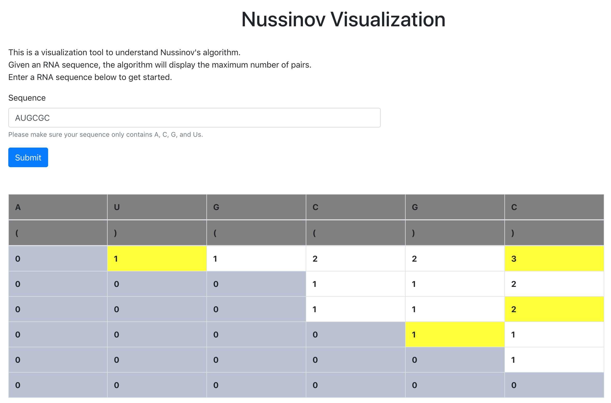

# Nussinov Algorithm Visualization 
by Thomas Yang, Betty Shen and Adarsh Ramchandran 
CS466 Bioinformatics final project 

You can explore our deployed version here: https://nussinov-visualization.herokuapp.com/ 

Or, to run locally, follow these instructions: 
(These instructions assume previous installation of npm and pip3)
1. Clone the repository with either HTTP or SSH 
2. Navigate to the repository 
3. cd frontend 
4. npm install 
5. npm start 
6. cd ../backend 
7. pip3 install requirements.txt
8. python3 nussinov.py 

You should be able to access the tool at localhost:3000. 
